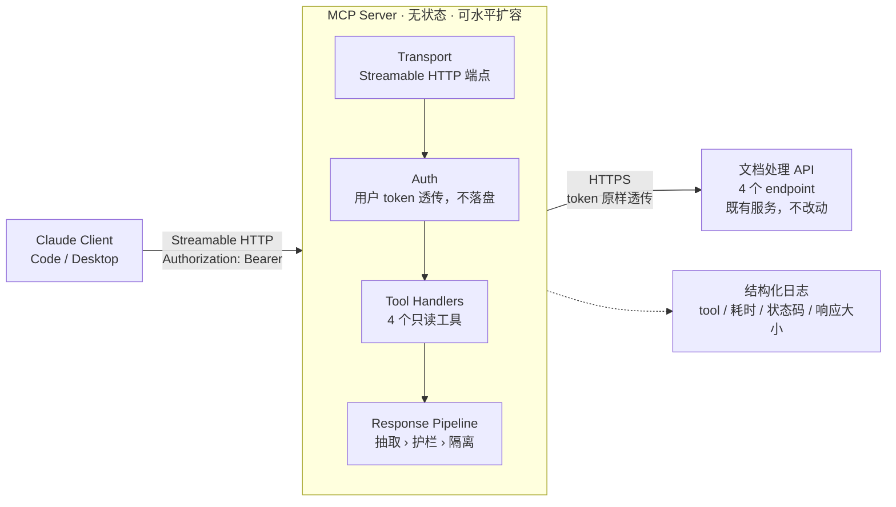
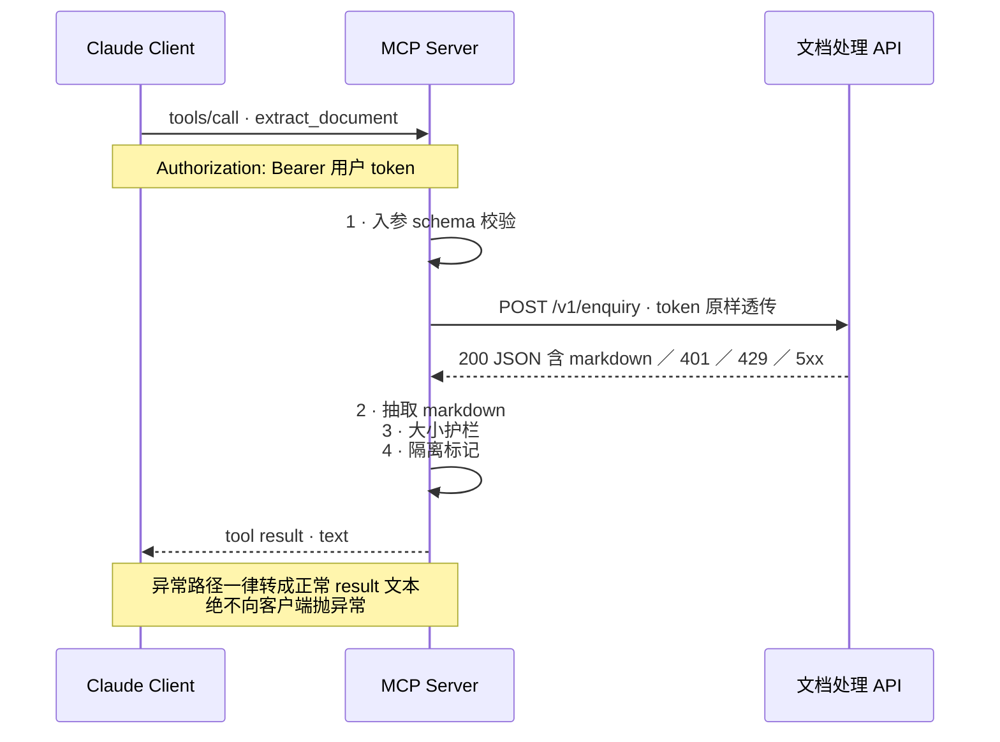

# 文档 API MCP 封装方案

把 4 个已有的文档处理 API 封装为一个远程 MCP 服务，并提交至 MCP marketplace。本文给出 9 项技术决策、工具契约、错误模型与一周交付计划。

| | |
|---|---|
| 版本 | v0.1 草案 |
| 日期 | 2026-08-31 |
| 状态 | 待评审 |
| 交付窗口 | 5 个工作日 |
| 阻塞项 | 4 项待确认（见 §13） |

> 渲染版（含样式与图）：`mcp/mcp-design-doc.html`，单文件自包含，浏览器直接打开。本文是可评审的源。

---

## §1 背景与目标

我们已有一组稳定的文档处理 API，参数与鉴权方式均已确定。目标是让 LLM 客户端（Claude Code / Claude Desktop 等）能够直接调用这些能力，因此需要一层 MCP 适配。

成功标准有两条：一是四个工具在真实问句下的调用准确率达标；二是在一周内完成 marketplace 提交并拿到受理。

## §2 范围

- 4 个只读 API 的 MCP 工具封装
- Streamable HTTP 远程部署
- 用户 token 透传鉴权
- JSON 响应中 markdown 字段的抽取与返回
- 结构化错误话术、响应大小护栏、结构化日志
- marketplace 提交材料与上架申请

## §3 架构总览

服务本身无状态：不持久化凭证，不缓存文档，不维护会话。所有请求携带调用方自己的 token，服务只做转换与转发，因此可以直接水平扩容。



*图 1 — 组件与数据流。上游 API 不做任何改动。*

## §4 调用时序与鉴权

鉴权采用**用户 token 透传**：客户端在 MCP 配置里带上 `Authorization` 头，服务原样转发给上游。这样上游审计日志里记录的是真实操作人，而不是一个共享的服务账号——在金融场景下这是硬要求。服务本身不存储、不刷新、不日志化任何 token。

token 过期的语义完全对齐上游：上游返回 401，服务把它翻译成一句人话，**作为正常的 tool result 返回**，而不是抛异常。只有这样模型才能读到它，并提示用户去重新认证。



*图 2 — 单次工具调用的完整链路，含异常路径约定。*

模型读不到异常内容，用户只会看到 “tool execution failed”，因此 401 / 429 / 5xx 全部走正常返回路径。

## §5 技术决策记录

以下九项是本方案需要评审确认的全部技术决策。每项给出结论与理由；理由部分是评审时最值得质疑的地方。

### D-01 传输形态：Streamable HTTP 远程部署

- **结论**：采用远程 Streamable HTTP，不做 stdio 本地分发。
- **理由**：与生态内主流 MCP 服务一致；集中部署便于统一审计和版本管理，无需每个用户本地安装。代价是要自行承担部署与可用性，但服务无状态，运维成本可控。

### D-02 鉴权：用户 token 透传

- **结论**：客户端配置中携带 `Authorization` 头，服务原样转发；不引入 service account，不实现 OAuth 流程。
- **理由**：上游审计需要看到真实操作人。服务不持久化凭证，把凭证生命周期完全留在上游，同时也把安全责任面收到最小。

### D-03 token 过期：语义对齐上游

- **结论**：上游 401 转为正常 tool result 文本，由模型向用户提示重新认证；不使用 HTTP 状态码向客户端报错。
- **理由**：MCP 层不承担 token 生命周期管理，行为与直接调 API 一致，用户心智模型不变。以异常形式返回则模型看不到内容，无法给出有效提示。

### D-04 能力映射：4 个 API 一对一封装

- **结论**：不做聚合、不做拆分，4 个 endpoint 对应 4 个工具。
- **理由**：工具数量远低于影响模型选择准确率的阈值（约 20 个），聚合只会增加复杂度而无收益。若后续 endpoint 增至十几个，再引入按意图聚合。

### D-05 入参 schema：沿用社区通行写法

- **结论**：参考 marketplace 上已有 sample repo 的 schema 风格，不自造规范。约束见 §6。
- **理由**：通行写法已被大量真实使用验证，且能降低 marketplace 审核摩擦。

### D-06 响应处理：抽取 markdown 字段后直接内联

- **结论**：从上游 JSON 中抽取 markdown 字段返回（实测约几 KB），不实现句柄、分片或检索。保留一道大小护栏作为兜底。
- **理由**：抽取后体积远低于单次 tool result 的合理预算（约 25k tokens），句柄方案在此规模下属于过度设计。护栏成本极低，用于防止异常大文档击穿会话——见 §7 与附录 A。

### D-07 错误模型：面向 LLM 而非 SRE

- **结论**：所有异常转为可读文本，分四类给出固定话术，每类都包含明确的下一步建议。详见 §8。
- **理由**：工具返回值的唯一读者是模型。堆栈和状态码对它没有意义，“该怎么办”才有意义。这一项对最终体验的影响大于其他任何单项。

### D-08 安全边界：只读 + 内容隔离

- **结论**：4 个工具全部标记为只读；上游返回的文档内容用隔离标记包裹。暂不实现脱敏与二次确认。
- **理由**：当前无写操作，风险面小。但文档内容来自外部，可能含提示词注入，隔离标记成本接近于零，现在做比事后补便宜得多。写操作的演进指引见 §11。

### D-09 可观测性：先埋点，暂不脱敏

- **结论**：所有 handler 统一经过一层中间件记录结构化日志，字段先记全；脱敏留作后续开关。
- **理由**：埋点位置集中在一处，将来加脱敏只改一个函数；若散落在各 handler，后补要动 4 个文件。当前投入约半小时。

> **版本管理**：发布版本由 marketplace 统一管理，本方案不额外设计。但需注意：**工具名称一经发布即为对外契约**，改名对已有会话是破坏性变更。命名规范在 §6 中约定，评审时一并确认。

## §6 工具契约

下表是需要在 Day 1 与 API owner 一起填完的映射表。结构已定，具体 endpoint 与参数待补。命名规范：`动词_对象`，全小写下划线，避免缩写。

| 工具名 | 用户意图 | 上游 endpoint | 读写 | 关键入参 | 返回 |
|---|---|---|---|---|---|
| `extract_document` | 把一份文档转成可读的 markdown 内容 | `POST /v1/enquiry` | 只读 | `doc_ref` | markdown 文本（约几 KB） |
| **待填** | — | — | 只读 | — | — |
| **待填** | — | — | 只读 | — | — |
| **待填** | — | — | 只读 | — | — |

### schema 约束

- 能枚举的一律用 `enum`，不用自由字符串。
- 日期、ID 一类易填错的参数，在 schema 里写死格式并在描述中给出示例值。
- 必填项取最小集，其余给默认值。

### description 规范

模型选工具、填参数只看名称和描述，因此描述是功能代码而不是文档。每条描述写三句：**做什么 / 什么时候用 / 什么时候不要用**。

反例：`"查询文档"`

正例：`"把指定文档转换为 markdown 文本并返回。需要文档标识符；只有文件名时先用 search_documents 取得标识符。不返回原始排版与图片。"`

## §7 响应处理管线

四步，全部集中在一个模块里，四个 handler 共用。

| 步骤 | 动作 | 说明 |
|---|---|---|
| 1 | 抽取 | 按集中配置的字段路径从上游 JSON 中取出 markdown。路径写在一处常量里，上游改字段只改这一处。 |
| 2 | 缺失分支 | 字段不存在 / 值为 null / 空字符串，三种情况分别返回不同话术——“文档无可提取内容”与“上游返回格式异常”对用户意味着完全不同的下一步。 |
| 3 | 护栏 | 估算 token 数，超过阈值（初始设 30k）截断并附说明。这是保险丝，不是分层策略：几 KB 是当前观测值而非 API 契约。 |
| 4 | 隔离 | 内容用 `<document_content>` 标记包裹，明确划出数据与指令的边界。 |

```python
MARKDOWN_PATH = "data.result.markdown"   # 集中一处，便于上游变更

def build_result(resp: dict) -> str:
    md = dig(resp, MARKDOWN_PATH)
    if md is None:      return ERR_SHAPE      # 上游返回格式异常
    if not md.strip():  return ERR_EMPTY      # 文档无可提取内容
    md, truncated = guard(md, max_tokens=30_000)
    return wrap(md, truncated)                # <document_content> ... </document_content>
```

> **观测点**：在护栏处记录每次响应的字节数与估算 token 数。如果实际数据分布与“几 KB”的假设不符，会先出现在监控里，而不是等用户报障。成本几行代码，正好对冲本期“暂不做分层”的风险。

## §8 错误模型

原则：错误是给 LLM 看的，不是给 SRE 看的。全部转为正常返回的可读文本，四类各有固定话术与预期行为。

| 类别 | 触发 | 返回给模型的话术 | 期望模型行为 |
|---|---|---|---|
| 参数错 | schema 校验失败 / 上游 400 | 指出哪个参数不合法、期望的格式与一个示例值 | 自行修正参数后重试 |
| 鉴权失败 | 上游 401 / 403 | 说明认证已过期或权限不足，请用户重新认证 | 停止重试，向用户说明并给出操作指引 |
| 限流 | 上游 429 | 说明当前请求过于频繁，建议稍后重试；如有 `Retry-After` 则透出 | 不立即重试，告知用户等待时长 |
| 上游故障 | 5xx / 超时 / 连接失败 | 明确说明是服务端问题、与用户输入无关，可稍后重试 | 不修改参数反复重试，如实告知用户 |

第四类的措辞尤其重要：如果不明说“与你的输入无关”，模型会开始猜测是参数问题并反复改参数重试，白白消耗轮次并误导用户。

## §9 可观测性

所有 tool handler 统一经过一层中间件，本期不做脱敏，字段先全量记录。

| 字段 | 用途 |
|---|---|
| `tool_name` | 工具使用分布，判断哪些工具描述需要迭代 |
| `caller_subject` | 从 token 解析出的调用方标识，用于审计 |
| `upstream_status` | 上游状态码，区分本层问题与上游问题 |
| `upstream_request_id` | 与上游日志串联排障 |
| `latency_ms` | 性能基线 |
| `response_bytes` / `est_tokens` | 验证 §7 的体积假设，触发护栏时告警 |
| `error_class` | §8 的四分类，用于统计各类错误占比 |

token 本身**永不进日志**，只记录从中解析出的 subject。

## §10 部署与配置

客户端侧的配置形态如下（字段名以 marketplace sample 为准）。需要在 Day 1 确认目标客户端支持哪种 header 配置方式。

```json
{
  "mcpServers": {
    "document-tools": {
      "type": "http",
      "url": "https://<host>/mcp",
      "headers": {
        "Authorization": "Bearer ${DOC_API_TOKEN}"
      }
    }
  }
}
```

- 服务端环境变量仅需上游 base URL 与超时配置，不含任何凭证。
- 健康检查端点与 MCP 端点分离，便于接入现有的负载均衡与探活。
- 无状态，副本数按并发线性扩即可。

## §11 风险与演进

| 风险 | 影响 | 应对 |
|---|---|---|
| marketplace 审核周期不可控 | 可能超出一周窗口 | 交付定义取“提交完成并受理”，“上架完成”单独跟踪 |
| 内部安全 / 合规评审串行阻塞 | 直接压缩开发时间 | Day 1 并行发起，不等开发完成 |
| 实际文档体积远超“几 KB” | 会话上下文被击穿 | §7 护栏兜底 + 监控告警；触发后按附录 A 演进 |
| 客户端不支持自定义 header | 透传鉴权方案不成立 | 见 Q-02，Day 1 必须验证 |
| 后续新增写操作 | 安全边界需要重新设计 | 届时引入两步式（prepare 返回影响面 → commit 执行）、幂等键、以及在描述中明示副作用。本期先保留 readonly 标记位 |

## §12 交付计划

| 日 | 内容 | 产出 |
|---|---|---|
| Day 1 | 填完 §6 映射表；确认 §13 全部待确认项；拉取 2–3 个 sample repo 作为模板；并行发起合规评审 | 工具映射表 · 提交 checklist |
| Day 2 | 服务骨架、transport、鉴权透传、响应管线；打通第一个工具端到端 | 可运行的单工具服务 |
| Day 3 | 补齐其余 3 个工具；错误模型四类话术；日志中间件 | 功能完整的服务 |
| Day 4 | Inspector 逐工具手测；接入真实客户端端到端；用 10–15 条真实问句验证工具选择与参数填写准确率，据此迭代描述 | 测试记录 · 描述定稿 |
| Day 5 | README、manifest、图标、许可与隐私说明；提交 marketplace；下午留作返工缓冲 | 提交受理回执 |

> **交付定义**：4 个工具全部跑通、真实问句验证通过、文档齐全、已提交 marketplace 并拿到受理回执。上架时间取决于审核方，不计入本次交付窗口。

## §13 待确认事项

以下四项需要在评审中或 Day 1 内闭环，否则会阻塞开发。

**Q-01 — 4 个 endpoint 的完整清单、参数与响应结构？**
阻塞 §6 全表 · 需要 API owner · Day 1 必须闭环

**Q-02 — 目标客户端是否支持为远程 MCP 服务配置自定义 `Authorization` 头？**
若不支持，D-02 透传方案不成立，需改走 OAuth，工期将显著超出一周 · Day 1 必须验证

**Q-03 — markdown 字段在上游响应中的确切路径，以及它的实际体积分布（p50 / p99）？**
影响 §7 抽取路径与护栏阈值 · 需要 API owner 提供真实样本

**Q-04 — 目标 marketplace 的提交材料清单与安全问卷要求？是否需要额外的内部合规审批？**
影响 Day 5 能否完成提交 · 需要 Day 1 完成调研并并行发起审批

## 附录 A — 大响应演进方案（本期不实施）

记录备查。如果 §9 的监控显示响应体积实际达到数百 KB 以上，本期的内联方案会失效，届时按下述方案演进。

基本盘：单次 tool result 的合理预算约 25k tokens（英文 JSON 约 90 KB，中文约 40 KB）。超过这个量级不仅撑爆上下文，还会打穿客户端的消息大小限制，并带来数十秒延迟。

**方案零（优先）**：与 API owner 协商，在上游增加 `fields` / `query` / 分页参数，把裁剪做在源头。投入产出比最高。

**方案一（句柄 + 读取工具）**：工具不返回内容，返回文档句柄、元信息与一份大纲；另加三个工具——`doc_outline` 返回结构树、`doc_read` 按片段游标读取、`doc_search` 全文检索定位。其中 `doc_search` 价值最高，多数真实问题一次检索即可命中，无需读全文。

配套要点：

- 文档存对象存储而非进程内存，TTL 1–2 小时。
- `doc_id` 用内容哈希以复用缓存。
- **句柄必须绑定调用方身份并在读取时校验**——否则即为跨用户数据泄露。
- 分块按页 / 章节等自然边界切分，块 ID 稳定可读，以便模型在回答中给出可验证的引用。

预计额外投入 1–1.5 个工作日。
